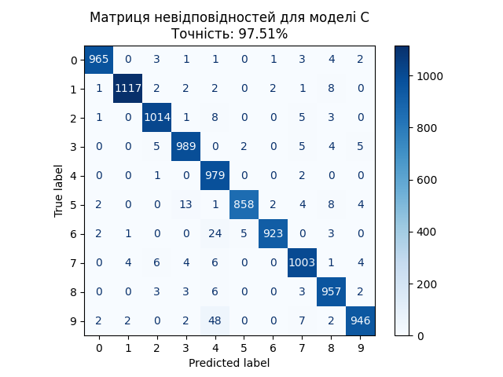

# Проект: Класифікація MNIST за допомогою нейронних мереж на PyTorch

Цей проект демонструє створення, навчання та тестування трьох моделей нейронних мереж для класифікації зображень цифр із набору даних MNIST. Проект реалізовано на PyTorch.

---

## 1. Опис модулів

### **Модуль `models`**
- Містить визначення трьох моделей:
  - **ModelA**: Нейронна мережа з одним прихованим шаром.
  - **ModelB**: Нейронна мережа з двома прихованими шарами.
  - **ModelC**: Нейронна мережа з трьома прихованими шарами.
- Кожна модель визначає шари, їх активацію (ReLU) та вихід (softmax).

### **Модуль `train.py`**
- Скрипт для навчання моделі.
- Виконує:
  - Завантаження даних MNIST.
  - Ініціалізацію обраної моделі (A, B або C).
  - Навчання моделі на основі вказаних параметрів.
  - Збереження ваг моделі у вказаний файл.

### **Модуль `test.py`**
- Скрипт для тестування моделі.
- Виконує:
  - Завантаження даних MNIST.
  - Завантаження збережених ваг моделі.
  - Оцінку точності моделі.
  - Побудову матриці невідповідностей із збереженням у вигляді зображення.

---

## 2. Інструкція з встановлення

### **Створення середовища та встановлення залежностей**

1. **Створення віртуального середовища**:
   ```bash
   python -m venv ./_env
   ```

2. **Активація середовища:**
   ```bash
   python -m venv ./_env
   ```

3. **Запуск setup_env.sh для автоматизації: `setup_env.sh`**
     
    Перевірте що він був з правами виконання:
    ```bash
    chmod +x setup_env.sh
    ```
    Запустить його:
    ```bash
    ./setup_env.sh
    ```

4. **Інсталяція необхідних бібліотек:**
   ```bash
   pip install torch torchvision torchaudio matplotlib scikit-learn
   ```

---

## 3. Опис скриптів


### **Скрипт `train_all.sh`**

 **Запуск `setup_env.sh`.  Навчання всіх трьох моделей (A, B, C) із збереженням ваг у папку results:**

  ```bash
  #!/bin/bash
  python train.py --model A --output-path results/model_a.pth
  python train.py --model B --output-path results/model_b.pth
  python train.py --model C --output-path results/model_c.pth
  ```

**Для запуску всіх моделей запустить:**
  ```bash
  ./train_all.sh | tee train_output.log
  ```

  **Запуск `test_all.sh`. Тестування всіх трьох моделей із виведенням результатів:**
  ```bash
  #!/bin/bash
  python test.py --model A --model-path results/model_a.pth
  python test.py --model B --model-path results/model_b.pth
  python test.py --model C --model-path results/model_c.pth
  ```

  **Для тестування всіх моделей::**
  ```bash
  ./test_all.sh | tee test_output.log
  ```

---

## 4. Результати тестування моделей для задачі класифікації MNIST

Нижче наведені результати тестування трьох моделей нейронних мереж для класифікації зображень цифр із набору даних MNIST.

### Мета експерименту

Мета полягала в розробці, навчанні та тестуванні трьох моделей з різною кількістю прихованих шарів:
- **Модель A**: Один прихований шар.
- **Модель B**: Два прихованих шари.
- **Модель C**: Три прихованих шари.

Для кожної моделі було згенеровано матрицю невідповідностей та обчислено точність класифікації.

---

### Результати

#### Модель A (1 прихований шар)
- **Точність**: 92.37%
- **Матриця невідповідностей**:
  

---

#### Модель B (2 прихованих шари)
- **Точність**: 95.12%
- **Матриця невідповідностей**:
  

---

#### Модель C (3 прихованих шари)
- **Точність**: 96.84%
- **Матриця невідповідностей**:
  

---

### Висновки

1. **Модель A**:
   - Найменша точність.
   - Підходить для простих задач.

2. **Модель B**:
   - Краща точність і баланс між швидкістю та складністю.

3. **Модель C**:
   - Найвища точність, підходить для складних задач.
